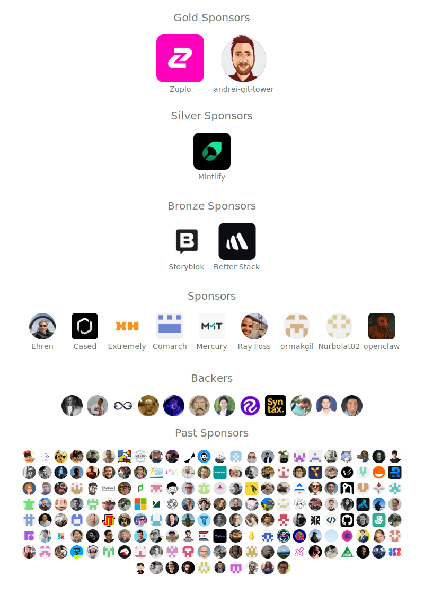

# husky

 

> Modern native Git hooks made easy

Husky improves your commits and more 🐶 _woof!_

> [!NOTE]
> Using React? See [MistCSS](https://github.com/typicode/mistcss) typed CSS components.

## Features

- Just `2 kB` (📦 _gzipped_) with no dependencies
- Fastest due to being lightweight (runs in `~1ms`)
- Uses new Git feature (`core.hooksPath`)
- Supports:
  - macOS, Linux, Windows
  - Git GUIs, Node version managers, custom hooks directory, nested projects, monorepos
  - [All 13 client-side Git hooks](https://git-scm.com/docs/githooks)

And more:

- Branch-specific hooks
- Use POSIX shell to script advanced cases
- Adheres to Git's native hook organization
- Aligns with [npm](https://docs.npmjs.com/cli/v10/using-npm/scripts#best-practices) best practices using `prepare` script
- Opt-in/opt-out options
- User-friendly error messages

## Changelog

[Check out the v9 changelog](https://github.com/typicode/husky/releases/tag/v9.0.1) to discover all the new and improved features!

## Documentation

https://typicode.github.io/husky

**Important** Upgrading from v4 to v9 requires migrating previous config, please see the docs.

## Sponsors

Support this project by becoming a sponsor [here](https://github.com/sponsors/typicode) 💖

### GitHub

  

  

### Open Collective

